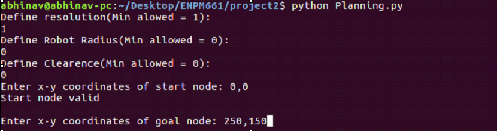
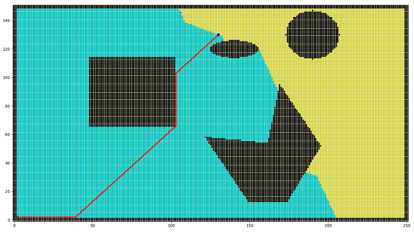

# ENPM661 - Project 2
Implementation of A-star and Dijkstra algorithms for a point robot and a rigid robot on a given map.

## Dependencies 
Written on python-2.7:
- numpy 
- matplotlib
- heapq

## Execution
- For point robot (Robot radius = 0)
    Run the following command for running the code with dijkstra algorithm
    ```
    python Planning.py --mode=dijk
    ```
    and for A-star 
    ```
    python Planning.py --mode=astar
    ```
There code requires entering certain parameters such as start-node, goal-node and resolution. This screenshot gives an example of what can be entered and how:


**Note**: There are two more command line arguments available:
- `--gui` (For turning the animation on and off). The arguments it takes are True for animation on, and 	False for no animation. For default the animation is always on.
- `--hur` (For different heuristic functions). The arguments it takes are euc for Euclidean distance as the heuristic function and man for Manhattan distance as the heuristic function. 

## Results
Here is shown the output of a sample situation with the following parameters:
-	Resolution: 1
-	Robot Radius: 0
-	Clearance: 2
-	Start Node: 2,2    (shown in green)
-	Goal Node: 130,130 (shown in blue)
The cyan nodes are explored nodes and Red is the optimal path obtained using dijkstra


## Playing around with the code
#### Changing the resolution(scale) of the grid
The minimum resolution allowed for the grid is 1 which corresponds to the maximum number 	of nodes possible(250 along x direction times 150 along the y direction). As the resolution is 	increased, the scale of the grid will increase i.e., resolution of 2 will generate a grid with 125 	points along x-direction times  75 along the y-direction.
#### Start and Goal node limits
The grid ranges from (0,0) to (250,150) with obstacles as given in the problem statement.